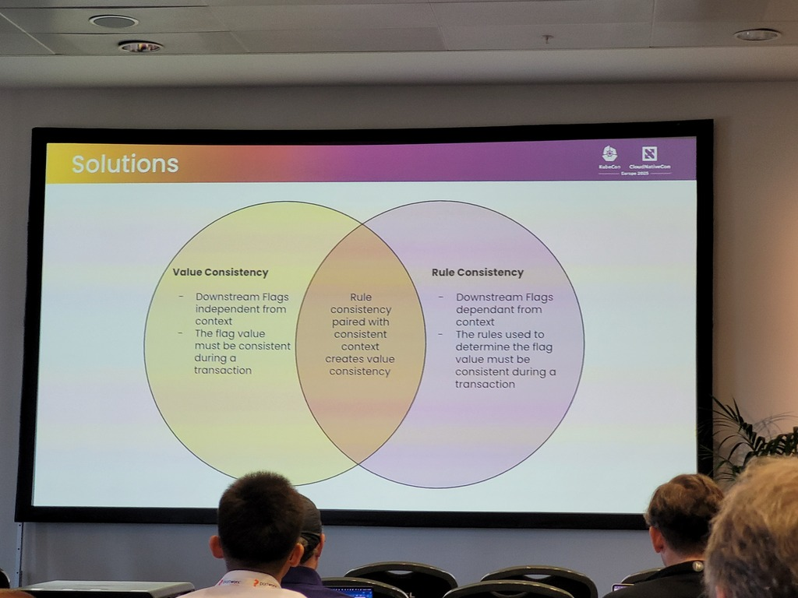
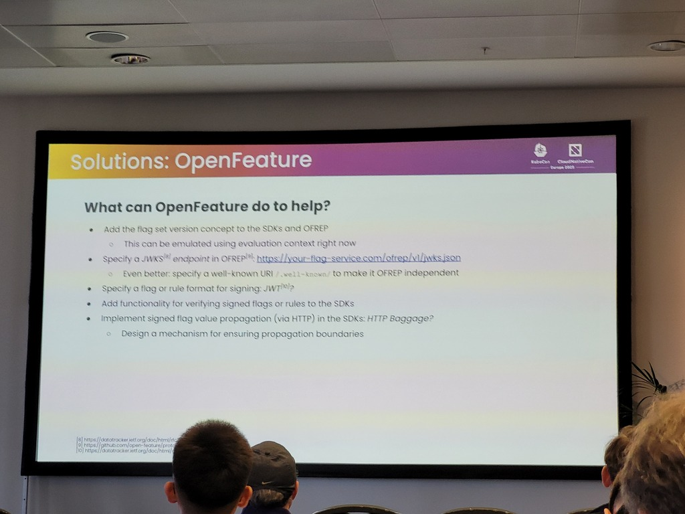

# Speakers
* Lukas Reining
* Christopher Bohlen - couldn't present
# Context / Use case
* Explanation of distributed computing
	* Feature flags in this context and not a broader sense (spans instances, workloads, components, devices)
* Fallacies of distributed computing like: network is reliable, secure, topologies remain unchanged, transport cost is zero, bandwidth is infinite 
* CAP Theorem (Consistency, Partition Tolerance, Availability)
# Challenges
* Inconsistencies during transactions
	* Example: expected higher demand during peak/holiday-season (job photo book printing services)
		* Left over old job services
* Network misconfiguration when processing 4k videos (availability problem)
* Needed context information in downstream calls (for example when taking into account user information)
# Solutions
* Interceptor between Value consistency and Rule consistency -> rule consistency paired with consistent context creates value consistency (see screenshot)
	* Obtain rule consistency -> flag set version addresses 90% of the earlier mentioned fallacies (not network reliability)
	* 
* Propagate the whole ruleset to downstream services
	* Fallacies not met: infinite bandwidth, network is secure, transport cost is zero
	* Obtain: 
		* Get rule consistency
		* Availability
		* Partition tolerance
* Context propagation (accumulated context downstream)
	* Get value consistency
	* Invalidates 6 out of 8 fallacies
* Flag value propagation
	* Only send out evaluated flags to downstream services
	* !
# Comments
* Check out various improvements to OpenFeature
* Very good deep dive talk which includes practical scenarios. Aligned with actual use cases in which distributed computing is relevant.

# Metadata
#openfeature #distributed-computing #feature-flags #partition-tolerance

