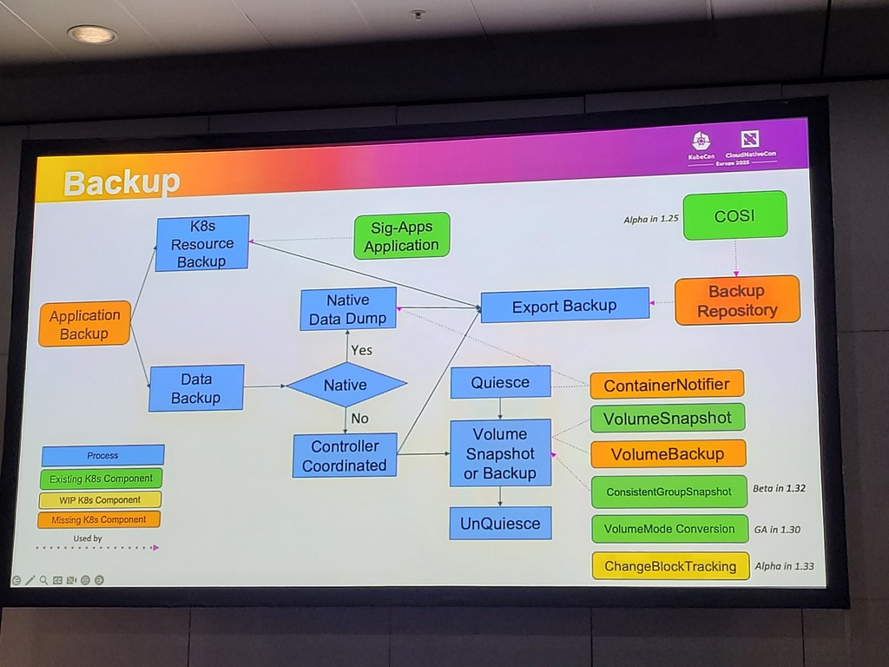
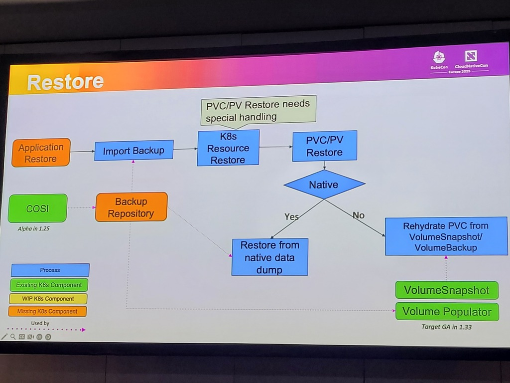
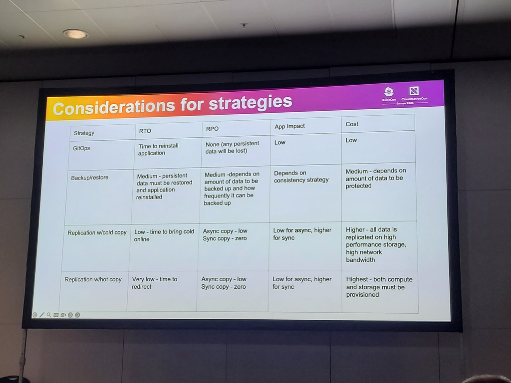
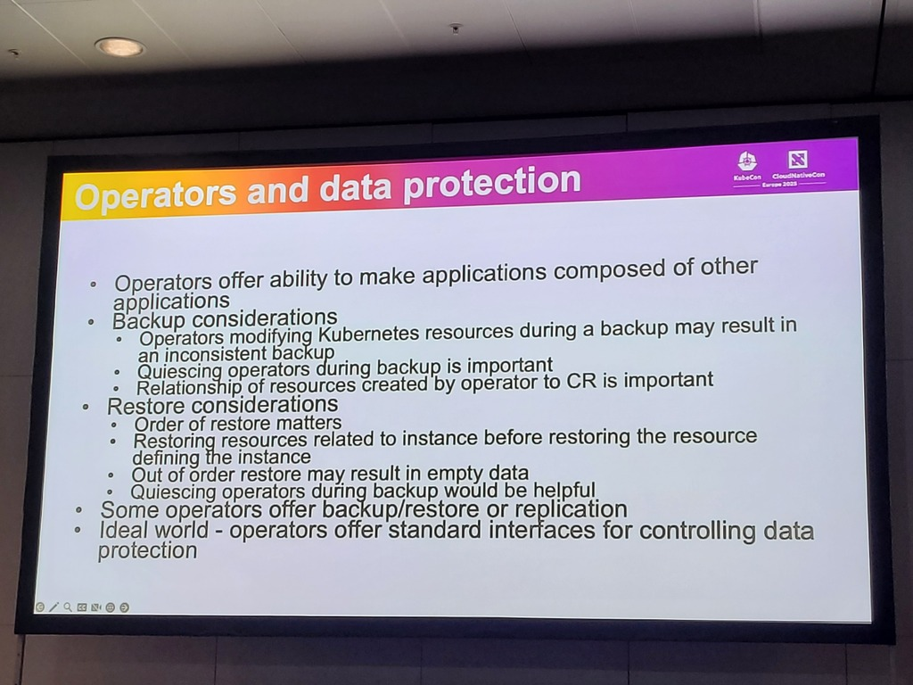
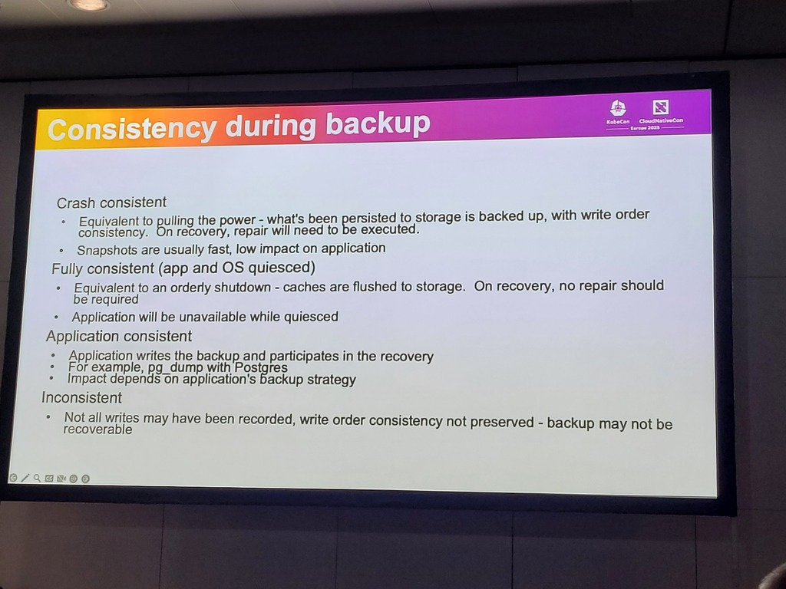

# Speakers
* Dave Smith-Uchida
* Xing Yang
# Context / Use case
* Current state & future of data-protection in kubernetes
* Day-1 operations covered very well, Day-2 operations are limited -> k8s secrets / configmaps and data stores in persistent volumes
# Backups & restores in k8s
## Application backup
* 2 sectopns:
	* K8s resource backup
	* Data backup
* Missing k8s components and a lot of components which are still WIP -> fill in this gap
* See screenshot for scheme
	* 
## Application restore
 * Using the backup repository to import the back
 * See screenshot for scheme
	 * 
# Data protection strategies
* Whitepaper for data protection strategies
* Great matrix with considerations (strategy, RTO, RPO, App impact, Cost) - see screenshot.
	* 
* Strategies:
	* GitOps
	* Backup/restore
	* Replication w/cold copy
	* Replication w/hot copy
* Great sheet of about limitations of replication compared to backup & restore
## Operators and data protections
* See screenshot for backup and restore considerations
	* Ideal world: standard interfaces for controlling data
* See screenshot
	* 
# Comments
* Consistency during backup: crash consistency, fully consistent, application consistent, inconsistent. See screenshot
	* 
* Slack: # wg-data-protection
* Very specialized, becomes relevant for advanced / specialized workloads on k8s

# Metadata
#backup #restore #data-protection #rpo #rto #storage