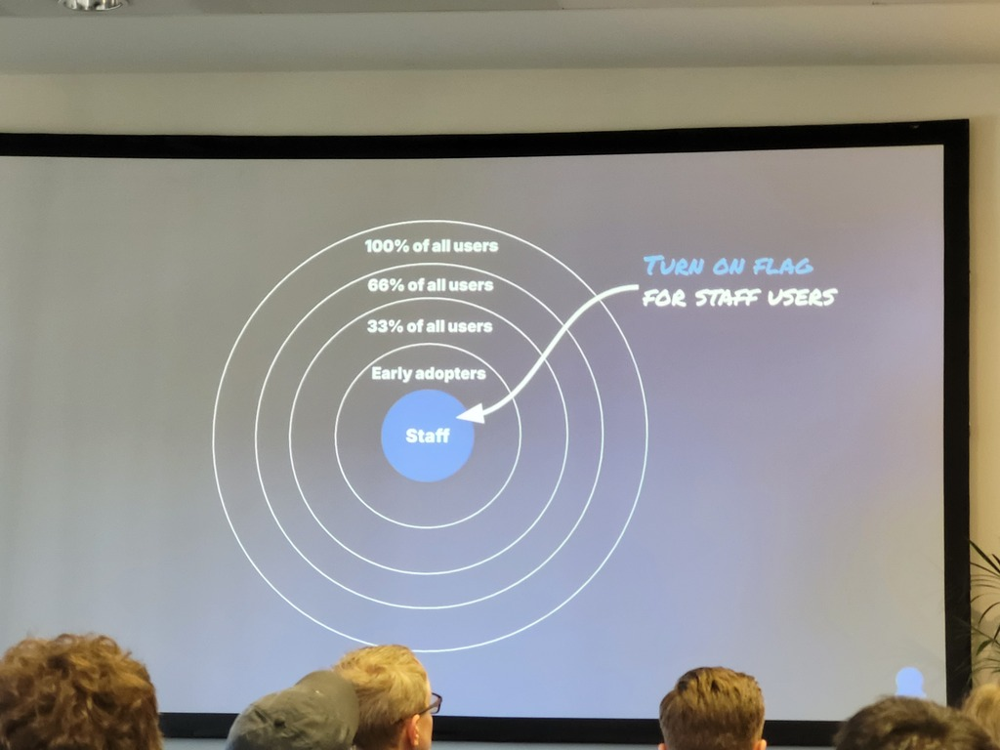
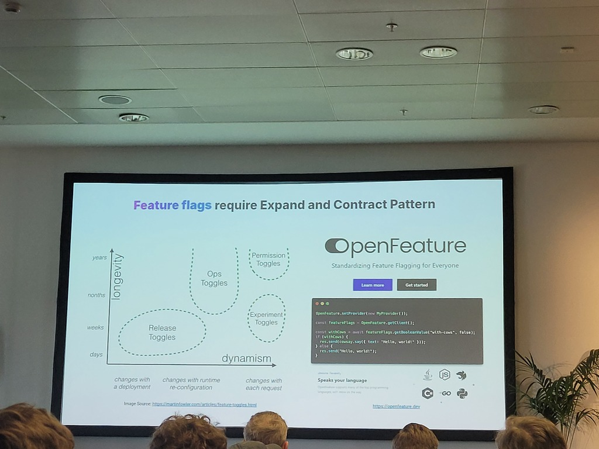

# Speakers
* Bob Walker (Octopus Deploy)
# Context / use case
### Myths
* Try to get feedback from your end-users -> rollback if something goes wrong
* Very unlikely that all code paths are touched every deployment -> it's just a small, stable group. It takes longs before reaching all users.
* Application should be architected once it supports Canary deployments in production
* Indiscriminate rollouts -> hamper user-experience (example: very different login screens over a short period of time) 
* Some deployments take longer than 30 min 
### Canary use cases
* Too fast to follow -> some 4 good use cases explained
### Openfeatures & progressive delivery
* Cell based architecture -> all dedicated application, cluster, instance, DB
* Separate deployment of new version versus a new feature
* Very good picture of layered circle to gradually enable the feature for different types of users (from staff to 100% of all users -> see screenshot)
	* 
* Expand and Contract Pattern
	* 
### Challenges
* Switch to Trunk based development -> merge small improvements from feature branches > don't wait for the feature to finish completely. Essential to get user feedback
* Feature flags are for SaaS only -> miss 25% of all customers
* Require expand and contract pattern (longevity versus dynamism)
* Not for DB changes (on-prem)

# Comments
* Good comparison of AWS Lambdas, Azure WebApps, Native K8s, Argo Rollouts (no screenshot -> check slidedeck)
* Great controversial topic against the trends which many applications don't even need

# Metadata
#openfeature #canary #releases #deployments #myths #tbd