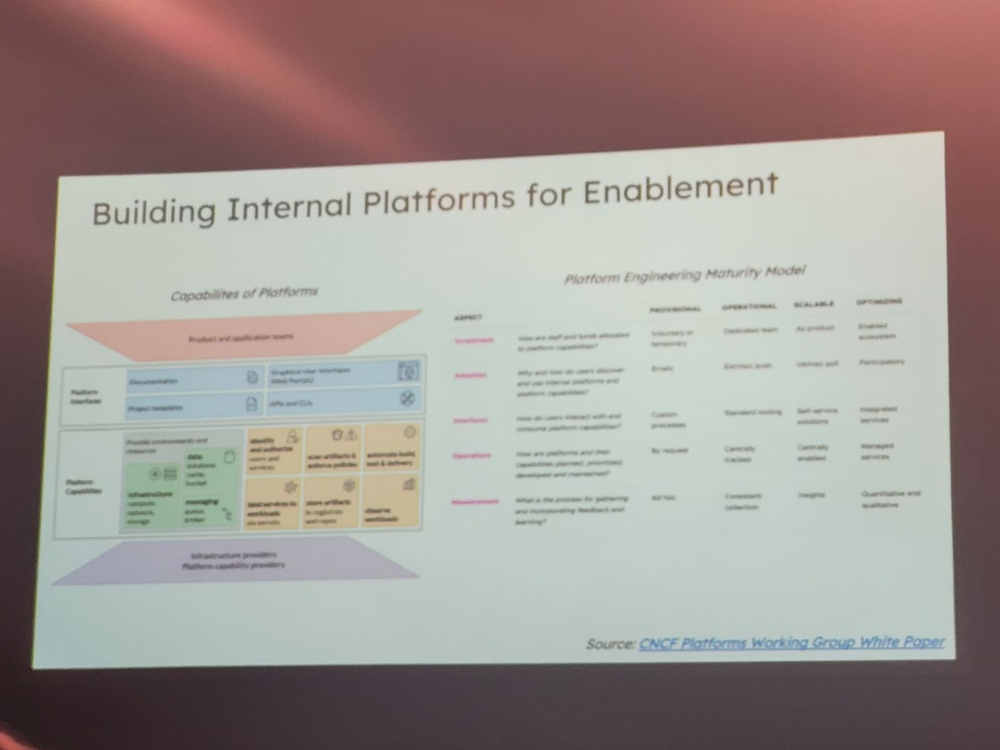
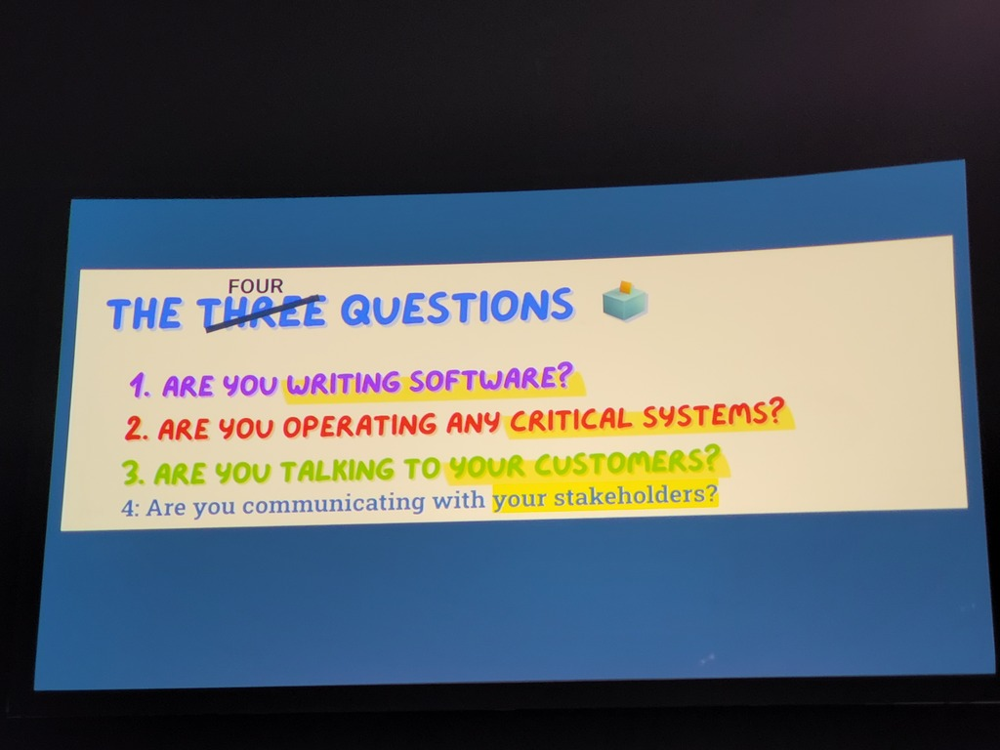
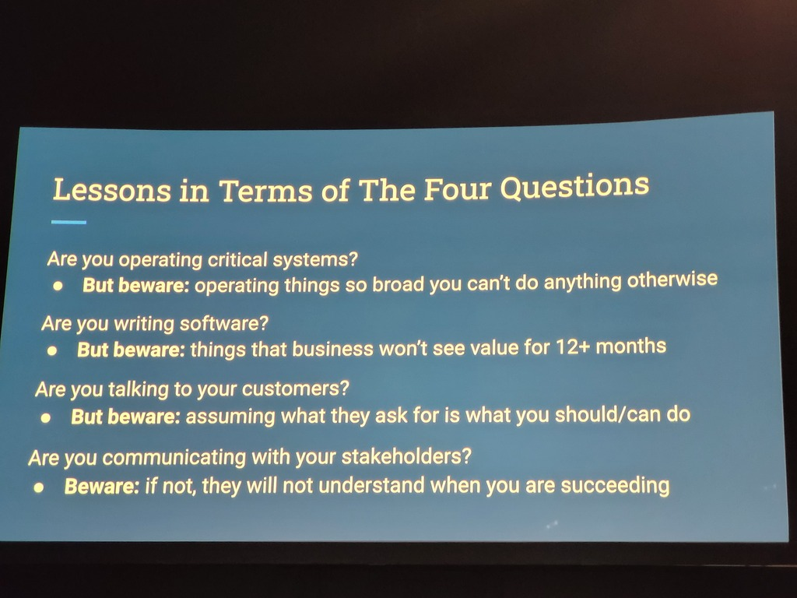

# Speakers
* Camille Fournier
* Ian Nowland
# Context / use case
* Tips and Tricks on how to build (start) a successful platform team and to scale it out
# Comments
* full full house
* When to start: as soon as the glue between components in your tech stacks hinders changing things
* Reference of the platform definition from Martin Fowler
* Ian shared his 4 failing platform team approaches
## 3 main goals:
* Manage complexity
* Create leverage << concentrate expertise
* Improve productivity (for DEV teams)
### 1 - Complexity
* Platform engineering -> software engineering (build abstractions to complexity) -> not setting up infrastructure (components)
* Not enough to just have SysOps -> being able to build own interfaces, instead of the shipped interfaces of the tools
### 2 - Leverage
* Strong system skill-set -> operational ownership
### 3 - Improve productivity
* Don't just optimize for costs -> curated product approach
* Developer productivity should be the absolute focus
* 

## !! Platform teams blend software engineering systems skills with a product focus !!
 * Don't start with product managers
 * Earning trust in the early days
 * Conduct market research among the developer community
	 * Adopt whatever has been created already by the DEV teams 
# Four great challenges / learnings 
* For details: see screenshots
		* 
		* 
# Resources
* Slidedeck: https://static.sched.com/hosted_files/kccnceu2025/80/Starting%20and%20Scaling%20Platform%20Team.pdf

# Metadata
#platform-team #scaling #onboarding