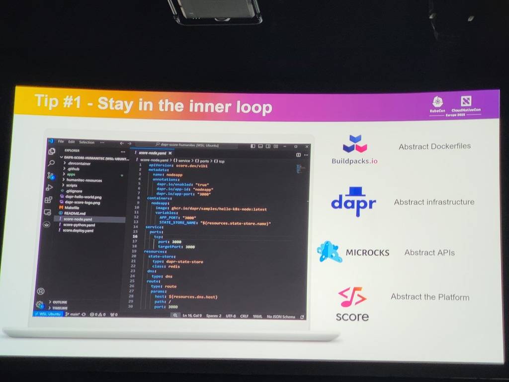
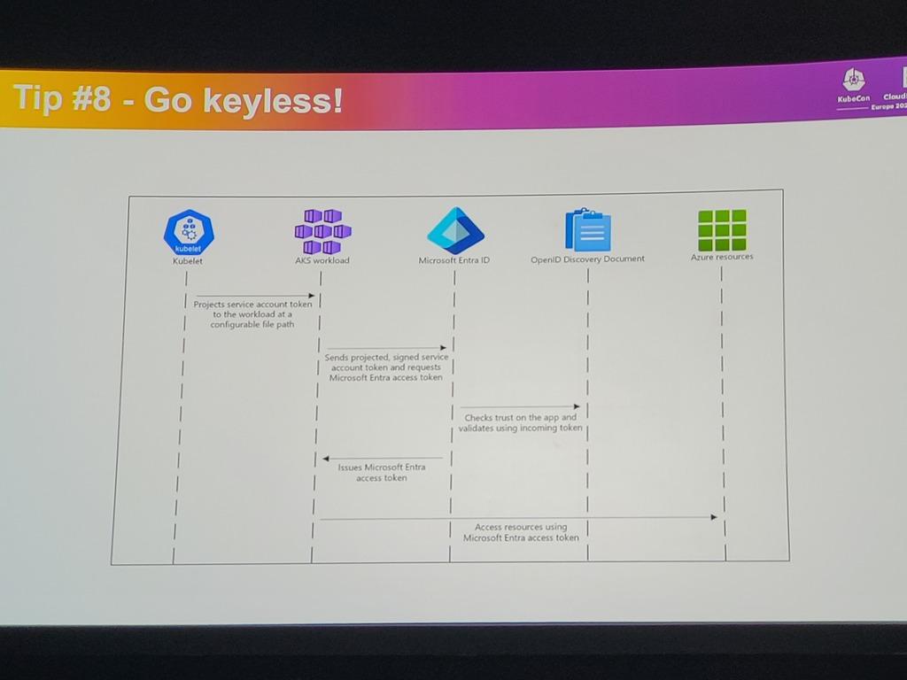

# Speakers
* Mathieu Benoit
* Maxime Coquerel
# Security governance framework
* Security review per cloud service
* Threat model
* Cloud control validation
* Pentesting
* Score card 
* Cloud governance board
# CNCF 4C security model
* code, container, cluster, cloud
* See https://www.cncf.io/blog/2022/02/14/kubernetes-security-best-practices-definitive-guide/ (2022)
# Tips
* Developer feedback / learnings:
	* Stay in the inner loop -> abstract Dockerfiles, infrastructure, APIs and the platform itself (see screenshot)
	* 
	* Enable self service: centralize tech documentation (backstage catalog)
	* Empower developers: increase visibility, enhance education, reduce ticketops
	* Prevent misconfigurations maturity levels from low to high:
		* Realtime notifications from the IDE
		* Detective
		* Preventive
		* Auto-remediation
		* AI Agents
	* Standardize the CI/CD pipelines
	* Go Keyless (see screenshot)
		* 
# Comments
* Great breakout/disruption -> security is too complex, hindering developers
* Applying the paradigm shift to shift security NOT to the teams but to have the platform implement them

# Metadata
#shift-left #shift-down #security #platform #platfom-team