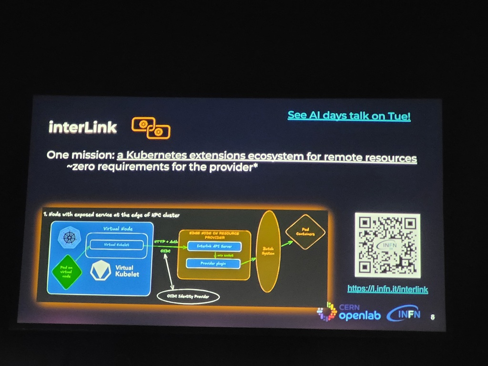
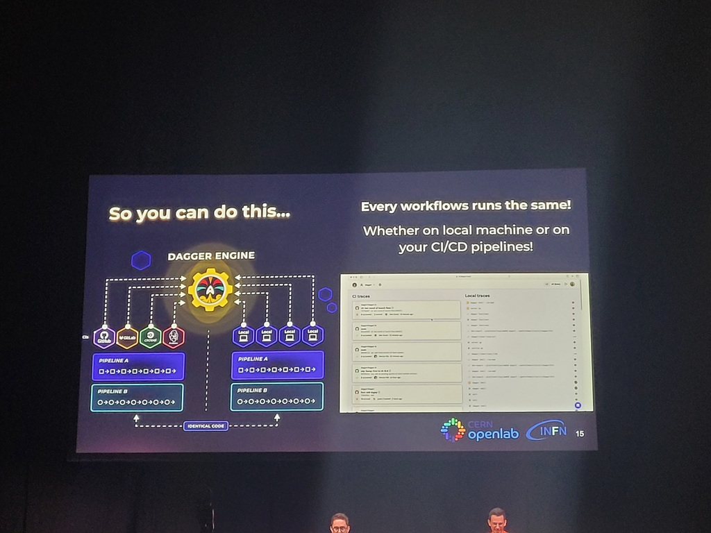
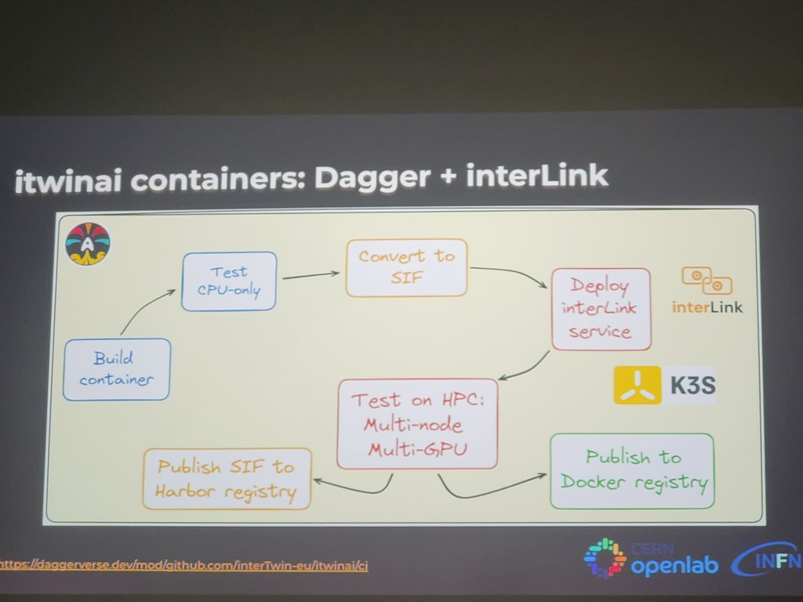

# Speakers
* Diego Ciangottini (Cern OpenLab)
* Matteo Bunino (INFN)
# Context / Use case
* Explanation of the Digital Twin concept:
	* Projecting wildfires
	* Flood impact modeling
	* Particle detector twin
* Building an engine for digital twins for multiple communities and consortium
* Elaboration on Interlink:
	* 
# Comments
* Create a common interface for heterogeneous resources
* Challenges:
	* Get user access
	* Let the software work on all platforms and with all container runtimes 
* Computer workloads run on a super computer, all transparant for the end-user
* Validated & used / not used tools:
	* Ray
	* Deepspeed
	* Horovod
	* Tune
	* ItwinAI
	* Weights and biases > cannot be used here
	* MLflow > cannot be used here
	* TensorBoard > cannot be used here
* Some language models are too big to fit on 1 CPU -> distribute across multiple nodes
* Testing the software
	* Cannot use the standard tools / framework since these won't work on the distributed and diverse system
	* Test execution framework: see screenshot
	* Challenge: testing containers on HPC
		* Dagger pipelines > avoid push and pray :)
			* Build -> Interlink -> Test on HPC -> Singularity
			* Start interlink service
			* Convert docker to Singularity
				* 
		* Solution: Dagger + interlink (HPC & Singularity containers before testing)
			* 
# Deeper dive
* Interlink + talk on TUE -> is now CNCF Sandboxed project
* Very good examples of the research projects being executed
* Hyper parameter optimization
* Daggerverse (intertwin-eu)
* Check slides afterwards for more context

# Metadata
#ai-containers #digital-twins #HPC #distributed #container-runtime #Interlink #singularity #research #government #science