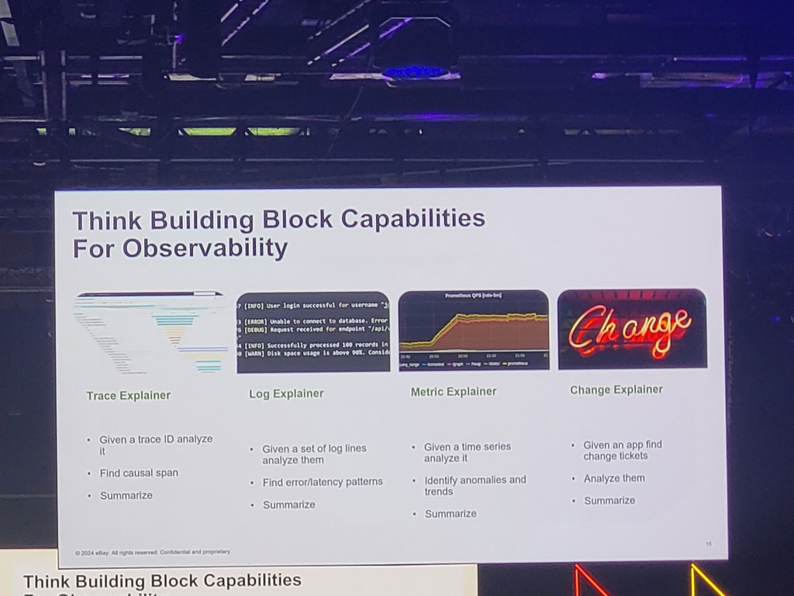

# Deeper dive
* Time Series Explosions (various talks)
* Examplars (SIG instrumentation) -> for OaaS team
* Usage metrics collector (SIG instrumentation) -> for OaaS team
* Cell based architecture
* Journey of a SIG (OpenTelemetry) 
* OpenTelemetry - concept of spans

# Metadata
#opentelemetry #observability #deepdive #examplars